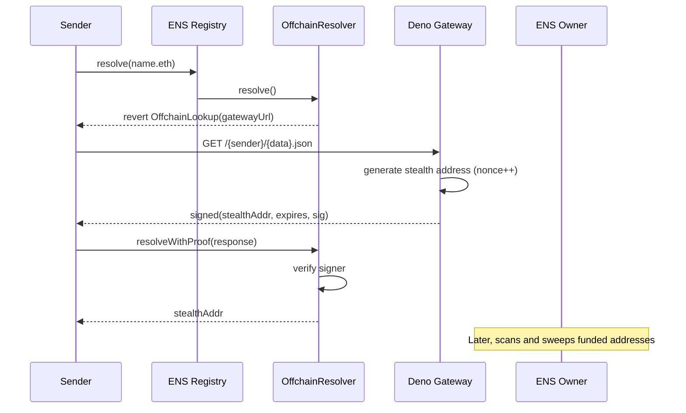
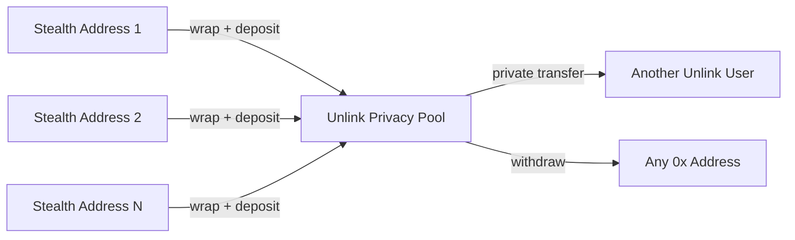

# Sneaky

Stealth addresses for ENS names. Every time someone resolves your ENS name, they get a fresh one-time address that only you can spend from.

Sneaky currently supports receiving **native ETH** on **Base Sepolia**. Once ETH lands at a stealth address, you can sweep it and route it through [Unlink](https://unlink.xyz) to break the on-chain link between the stealth address and your wallet.

## How it works



1. An ENS name owner **registers** with Sneaky -- this points their name at an offchain resolver contract on Ethereum mainnet and stores their stealth key material on the gateway.
2. When a sender resolves the name, the resolver **reverts with `OffchainLookup`** (EIP-3668), directing the client to the Sneaky gateway.
3. The gateway **generates a fresh stealth address** (incrementing a nonce), signs the response, and returns it.
4. The client calls **`resolveWithProof`** on the resolver, which verifies the gateway signature and returns the stealth address to the sender.
5. The sender **sends ETH** to that one-time address on Base Sepolia.
6. The owner **scans** all generated addresses, finds which ones have funds, derives the private keys, and **sweeps** them -- optionally through Unlink for privacy.

## Architecture

The project has three components:

- **`contracts/`** -- Solidity smart contracts deployed to Ethereum mainnet. `OffchainResolver` implements EIP-3668 CCIP-Read: it reverts with a gateway URL on `resolve()` and verifies signed responses in `resolveWithProof()`. `SignatureVerifier` handles the EIP-191 proof format. Deployed at `0x59DC96E5925B70f88bF1031C70E030779C619bf0` via Hardhat Ignition.

- **`deno/`** -- EIP-3668 CCIP-Read gateway running on Deno Deploy. Generates stealth addresses using `@fluidkey/stealth-account-kit`, stores user registrations and nonces in Deno KV, and signs CCIP responses so the on-chain resolver can verify them. Also exposes `/register`, `/deregister`, and `/status` endpoints for the frontend.

- **`app/`** -- React Router 7 single-page app with RainbowKit and wagmi. The home page (`/`) lets you register or deregister your ENS name. The wallet page (`/wallet`) scans for funded stealth addresses on Base Sepolia and provides sweep + Unlink operations.

## Unlink integration

Stealth addresses hide *who is receiving*, but once you want to consolidate those funds you need to move them somewhere -- and that can create a visible on-chain link back to you. [Unlink](https://unlink.xyz) breaks that link by routing funds through a privacy pool.

Sneaky only generates stealth addresses for receiving **native ETH**. Each stealth address independently wraps its ETH to WETH and deposits directly into the Unlink privacy pool -- the connected wallet is never involved on-chain, so no two stealth addresses are ever linked together.



### Deterministic private account

When connecting to Unlink, the user signs a fixed message. The signature is hashed with keccak256 and the first 128 bits become entropy for a BIP-39 mnemonic (via `@scure/bip39`). The same wallet always derives the same Unlink account -- there is no seed phrase to back up.

### Sweep-to-Unlink pipeline

The `useUnlink` hook manages a multi-step flow that runs independently for each funded stealth address, so no two stealth addresses are ever linked on-chain:

1. **Wrap** -- from the stealth address itself, call `WETH.deposit()` on Base Sepolia to convert its ETH into WETH. Unlink operates on ERC-20 tokens, not native ETH, so this step is required.
2. **Deposit** -- still from the stealth address, approve the WETH spend and call `client.deposit()` through a temporary Unlink SDK client scoped to that stealth wallet. The same mnemonic-derived Unlink account is used, but the on-chain signer is the stealth address.
3. **Poll** -- wait for the deposit to be confirmed inside Unlink.

Each stealth address needs enough ETH to cover gas for the wrap, approval, and deposit transactions. The gas budget is higher than a simple transfer (~350k gas vs 21k), but the remaining ETH is fully converted into WETH and deposited into the privacy pool. The connected wallet is never involved in on-chain transactions during this flow.

### Operations inside Unlink

Once funds are in the privacy pool:

- **Private transfer** -- send to another Unlink address (`unlink1...`) with no on-chain trace linking sender to recipient.
- **Withdraw** -- exit from Unlink to any `0x` EVM address. The withdrawal appears as a transfer from the Unlink contract, not from your wallet.
- **Deposit more WETH** -- top up your Unlink balance from the connected wallet at any time.

## Tech stack

- **Frontend**: React 19, React Router 7 (SPA mode), Vite, Tailwind CSS 4, shadcn/ui
- **Wallet**: wagmi 3, RainbowKit, viem
- **Stealth keys**: `@fluidkey/stealth-account-kit`
- **Privacy**: `@unlink-xyz/sdk`, `@scure/bip39`
- **Contracts**: Solidity 0.8.28, OpenZeppelin, Hardhat 3, Hardhat Ignition
- **Gateway**: Deno, Deno KV

## Getting started

### Prerequisites

- [Bun](https://bun.sh) (frontend package manager and runtime)
- [Deno](https://deno.com) (gateway, optional for local development)
- A [WalletConnect / Reown](https://cloud.reown.com/) project ID

### Frontend

```bash
bun install
cp .env.example .env
# fill in at least VITE_WALLETCONNECT_PROJECT_ID and VITE_OFFCHAIN_RESOLVER_ADDRESS
bun run dev
```

The dev server starts at `http://localhost:3000`.

### Gateway (local)

```bash
cd deno
deno run -A --unstable-kv --env-file=.env main.ts
```

By default the frontend points at the hosted gateway (`https://sneaky-api.blossom.deno.net`). Set `VITE_GATEWAY_URL` to use a local instance.

### Contracts

```bash
cd contracts
npm install
npx hardhat ignition deploy ignition/modules/OffchainResolver.ts --network mainnet
```

The resolver is already deployed to Ethereum mainnet. You only need this if you are deploying a fresh instance.

## Environment variables

### Frontend (`.env`)

| Variable | Required | Notes |
|----------|----------|-------|
| `VITE_WALLETCONNECT_PROJECT_ID` | Yes | WalletConnect / Reown project id |
| `VITE_OFFCHAIN_RESOLVER_ADDRESS` | Yes | Deployed OffchainResolver on Ethereum mainnet |
| `VITE_UNLINK_API_KEY` | For Unlink | Unlink staging API key |
| `VITE_ALCHEMY_API_KEY` | No | Alchemy RPC for mainnet + Base Sepolia |
| `VITE_DRPC_API_KEY` | No | dRPC fallback if Alchemy is not set |
| `VITE_GATEWAY_URL` | No | Defaults to `https://sneaky-api.blossom.deno.net` |

### Gateway (`deno/.env`)

| Variable | Required | Notes |
|----------|----------|-------|
| `ENS_RPC_URL` | Yes | Ethereum RPC for ENS ownership checks |
| `CHAIN_ID` | No | Stealth address target chain (default: `84532` / Base Sepolia) |
| `CCIP_TTL` | No | CCIP signature validity in seconds (default: `300`) |

## Project structure

```
app/
  routes/
    home.tsx          Registration and deregistration UI
    wallet.tsx        Stealth address scanning, sweep, and Unlink
    about.tsx
  hooks/
    use-register.ts   ENS registration flow
    use-stealth-addresses.ts  Scan and derive stealth keys
    use-unlink.ts     Unlink sweep / deposit / transfer / withdraw
    use-deregister.ts ENS deregistration flow
    use-dark-mode.ts
  utils/
    stealth.ts        Fluidkey message generation
    gateway.ts        HTTP client for the Sneaky gateway
    ens.ts            ENS registry address and ABI
    unlink.ts         Unlink constants and mnemonic derivation
    wallet.ts         wagmi / RainbowKit config
  context/
    wallet-provider.tsx  Wagmi + RainbowKit providers
  components/ui/      shadcn components
  data/
    site.ts           App name
    supported-chains.ts  Chain and transport config
contracts/
  contracts/
    OffchainResolver.sol
    SignatureVerifier.sol
    IExtendedResolver.sol
  ignition/           Hardhat Ignition deployment
  scripts/            Maintenance scripts
deno/
  main.ts             CCIP-Read gateway server
```

## Key concepts

**Stealth addresses** -- one-time addresses derived from a shared key scheme (spending public key + ephemeral private key). Only the ENS name owner can compute the corresponding private key to spend funds.

**EIP-3668 CCIP-Read** -- an ENS standard for offchain data. The resolver contract reverts with a gateway URL instead of returning data directly. The client fetches from the gateway, then calls `resolveWithProof` so the contract can verify the signed response on-chain.

**Fluidkey** -- the `@fluidkey/stealth-account-kit` library used for key derivation. A single wallet signature produces deterministic spending and viewing keys. Combined with an incrementing nonce and chain ID, these generate unique stealth addresses for each resolution.

**Unlink** -- a privacy protocol that breaks on-chain links between source and destination. Funds enter a pool as WETH and can be privately transferred to other Unlink users or withdrawn to any address without revealing the depositor.

## License

[AGPL-3.0](LICENSE)
